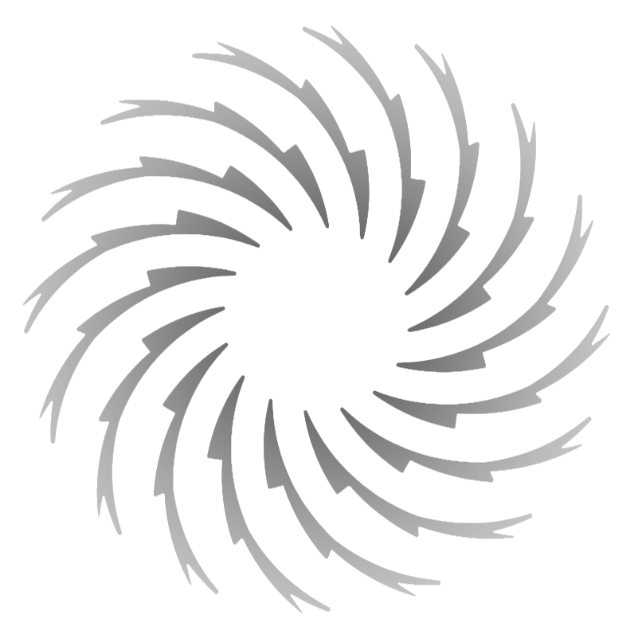

  

   

  # Möbius

Ideas loop here forever — never quite beginning, never quite ending.

  
  

## Focus Areas

- Computer Vision
- Action Recognition
- Object Detection

## Tech Surface
- Programming
  
  
  
  
  
  

- Tools
  
  
  

- Operating Systems
  
  

- Frameworks
  
  

   
---

  <!-- ## Writings   -->
  <!-- Coming soon — thoughts, experiments, and rabbit holes will appear here -->

  ## Visitor Ripple

  

   

  Made with curiosity in Auckland · ∞
